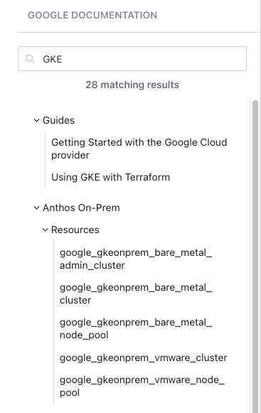
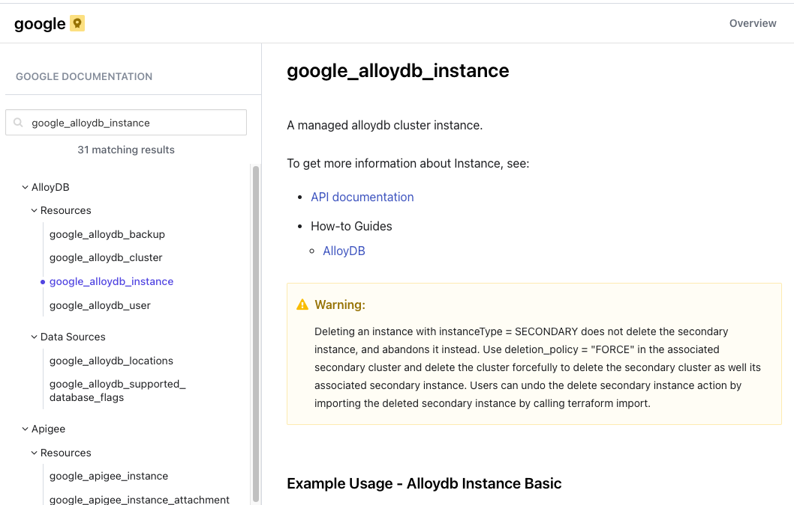

> [Source Documentation]()

Working with [Providers](https://developer.hashicorp.com/terraform/language/providers) is the fundamental skill required when working with OpenTofu. Each Provider is a plugin that OpenTofu uses to manage a specific infrastructure platform. Providers are responsible for understanding API interactions and exposing resources for managing infrastructure. For most infrastructure platforms, there is a corresponding provider that can be used to manage resources on that platform, which is managed by the vendor or an open source community.

Visit the Terraform Registry to browse popular providers:

  * [https://registry.terraform.io/](https://registry.terraform.io/)

**Note**: OpenTofu is forking these modules in their own registry. However they do not have yet a nice UI to browse them. You can find more information abut their registry here:

* [OpenTofu Registry](https://registry.opentofu.org/)

# Tasks

Complete these tasks for this scenario. 

## Task 1: Review Google Cloud Provider

> Let's look at the provider for [Google Cloud](https://registry.terraform.io/providers/hashicorp/google/latest). To get an understanding of how you can find what you need, let's search for the provider in the Terraform Registry:

As we can see, we have found a provider called `hashicorp/google`. The naming pattern `hashicorp/<provider-name>` indicates that HashiCorp maintains this provider. In addition, the Provider is tagged as official, which means the vendor maintains it. However, there might be the case where you have multiple providers for the same platform. In that case, it's always good to check the provider documentation to see which one is the best fit for your use case and which project is still actively maintained.

> If you click on `Use Provider`, you can see the provider configuration that is required to use the provider in your configuration:

> When you click on [Documentation](https://registry.terraform.io/providers/hashicorp/google/latest/docs) you get to the documentation of the provider. Here you can find all the resources and data sources that are available for the provider. On the landing page you can find the provider configuration and the provider requirements. Essentially what kind of configuration is required to connect to the infrastructure:

This documentation is always provided for each provider and is a good starting point to understand how to use the provider in your configuration. Each Provider requires different configuration options. Therefore you can't really have a generic approach to provider configuration.

> On the left side, you can review all the resources and data sources that are available for the provider. If you open a category, you can see all the resources and data sources that are available in that category:

> If you are looking for something specific, you can search for it in the search bar. This will list all the relevant resources and data sources that might be helpful in finding the right resource for your use case:

> Each resource has its own arguments, which are configured by you. Let's take a look at the resource `google_alloydb_instance`:

> The [resource documentation provides](https://registry.terraform.io/providers/hashicorp/google/latest/docs/resources/alloydb_instance) you with all the information you need to configure the resource in your configuration. It provides you with the following information:

* **Reference/Examples**: Usage examples
* **Arguments**: The arguments required to configure the resource.
* **Attributes**: The available attributes after the resource is created.
* **Import**: The import information required to import an existing resource into your configuration.
* **Notes**: Additional notes that are relevant to the resource.

> For comparison, let's look at a data source. Data sources are used to fetch information from the infrastructure. Let's take a look at the data source `google_alloydb_locations`:

We can see that the data source has the same structure as the resource. It provides you with the same information as the resource documentation. However, there are probably less arguments that are required to configure the data source. Here, the most interesting aspect are the attributes that are available after the data source is fetched.
