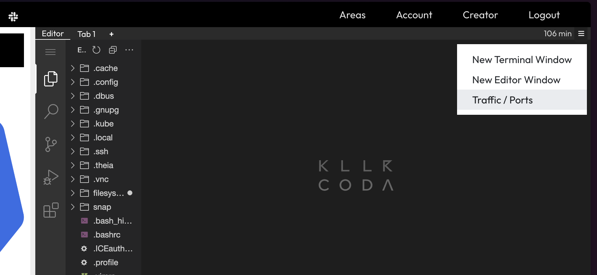
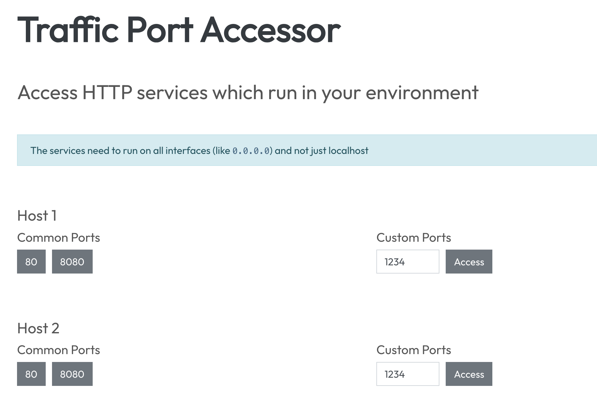

# Traffic Ports

You can access ports from the nodes in this scenario. On the top right you can see a small burger-menu. Click on it and select `Traffic / Ports`:



On this overview we can select which ports we want to forward to which node. For this scenario we are mainly going to use **Host 2**:



You will be instructed with specific ports for the following technologies.

# ArgoCD

You can access [ArgoCD Dashboard]({{TRAFFIC_HOST1_30080}}) to start playing around with argocd.


Once you have the port, you can access the ArgoCD Dashboard. The credentials for the login are:

- Username: `admin`
- Password: `admin`


The [argocd cli](https://argo-cd.readthedocs.io/en/stable/getting_started/) is available:

```shell
argocd -h
```{{exec}}

# FluxCD

The [flux cli](https://fluxcd.io/flux/cmd/) is available:

```shell
flux -h
```{{exec}}
