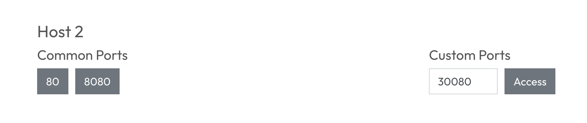
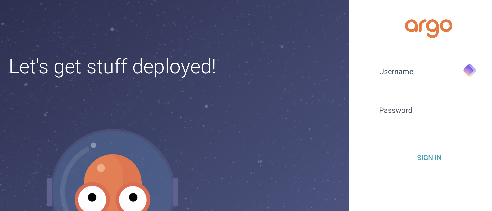

# ArgoCD

You can access [ArgoCD Dashboard]({{TRAFFIC_HOST1_30080}}) to start playing around with argocd.



Once you have the port, you can access the ArgoCD Dashboard. The credentials for the login are:

- Username: `admin`
- Password: `admin`



The [argocd cli](https://argo-cd.readthedocs.io/en/stable/getting_started/) is available:

```shell
argocd -h
```{{exec}}

# FluxCD

The [flux cli](https://fluxcd.io/flux/cmd/) is available:

```shell
flux -h
```{{exec}}

## Tofu-Controller
