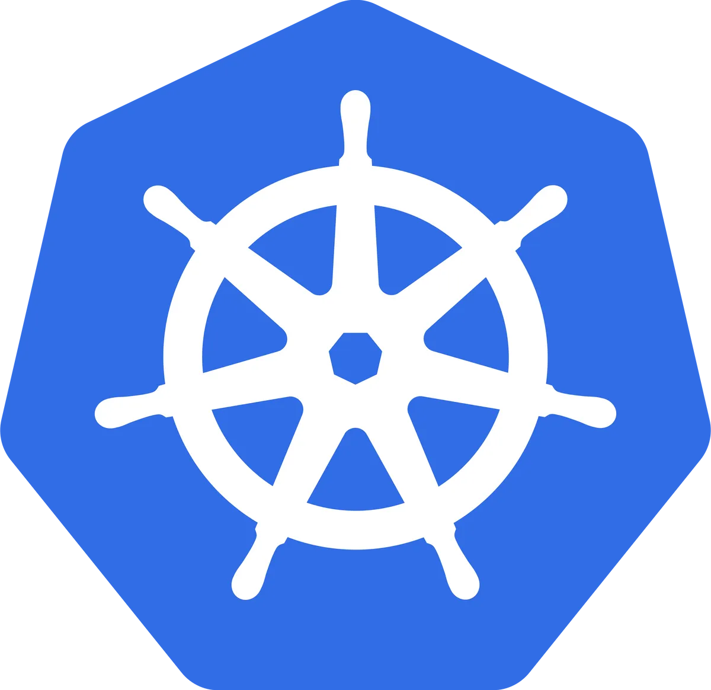

## About this Playground

In this playground, you will learn how to work with GitOps. You have ArgoCD and Flux available to you.

# Finishing

When you are done with playing around you can finish the scenario by running clicking `Check`.
